# Variables and Datatypes
## Variables in Python
- Values assigned to variables using an assignment operator.
- Variable name should be short and descriptive. 
  - Avoid using variable names clash with inbuilt functions.
- Designed to indicate the intent of its use to the end user.
- Avoid one character variable names.
  - one character variable names are usually used in looping constructs, fucntions, etc. 

## Naming Variables
- Variables can be named alphanumerically
  ```python
  Age = 5
  age = 55
  age2 = 55
  Age2 = 55
  ```

- However the first letter must start with an alphabet(lower case or uppercase).

```python
2age = 55

# Output
File "/Users/sanketkumarpanda/Desktop/Python-getting-started/Day-02/variables.py", line 8
    2age = 55
     ^
SyntaxError: invalid syntax
```

Special character
- Underscore(-) 
- Use of anyother character will throw an error
- Variable names should not begin or end with underscore even though both are allowed
  
```python
Employee_id = 501 # Valid

Employee@id = 501 #invalid

File "/Users/sanketkumarpanda/Desktop/Python-getting-started/Day-02/variables.py", line 11
    Employee@id=501
    ^
SyntaxError: cannot assign to operator

# These are allowed but not a good practice
_age=55
age_=55
```
## Naming Conventions
Commonly accepted case types
- Camel (lower and upper)
- Snake
- Pascal
  
```python
# Camel
ageEmp=45
AgeEmp=45

# Snake
age_emp=45
Age_emp=45

#Pascal
AgeEmp=45
```
## Assigning values to multiple variables
**code**

```python
physics,chemistry,mathematics=89,90,75
```
**Values reflected in environment**

We can get this using breakpoint and instead of run the code, we have to debug.

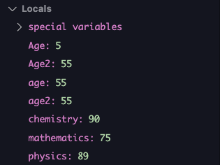

## Datatypes

### Basic Data types

| Data Types    | Description | values | Representation |
| ------------- | ------------- | ------------- | ------------- |
| Boolean  | represents two values of logic and asscoiated with condtional statements | True and False | bool |
| Integer | Positive and Negative whole numbers | set of all integers, Z | int |
| Complex | contains real and imaginary part (a+ib)| set of all complex numbers | complex |
| Float | real numbers | floating point numbers | float |
| String | all strings or characters enclosed between single or double quotes | sequence of characters | str |

### Identifying object data type
Find data type of object using

*Syntax:* type(object)

```python 
Employee_name = "Ram"
````
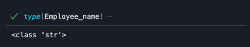

```python 
Age=55
````
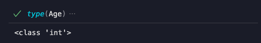

```python 
Height=150.6
````
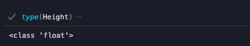

### Verifying Object data type
Verify if an object is of certain data type.

*Syntax:* type(object) is datatype.

```python 
type(Height) is int
````
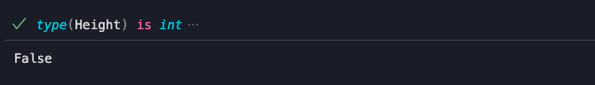

```python
type(Age) is float
```
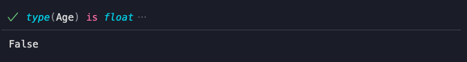
```python
type(Employee_name) is str
```
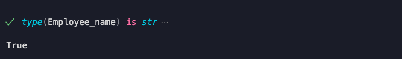

### Coercing(Persuading) Object to new data type

- Convert the data type of an object to another
- *Syntax:* datatype(object)
- Changes can be stored in same variable or in different variable

```python 
# Storing it in another variable
ht=int(Height)
type(ht)
````
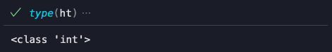
```python
# Storing it in the same variable
Height=int(Height)
type(Height)
````
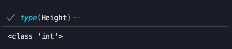

Only few coercions are accepted. Consider the variable `Salary_tier` which is of string data type.`Salary_tier` contains an integer enclosed between single quotes.

```python
Salary_tier='1'
type(Salary_tier)
Salary_tier=int(Salary_tier)
type(Salary_tier)
```
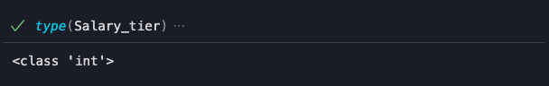

```python
Employee_name="Ram"
Employee_name=float(Employee_name)
```
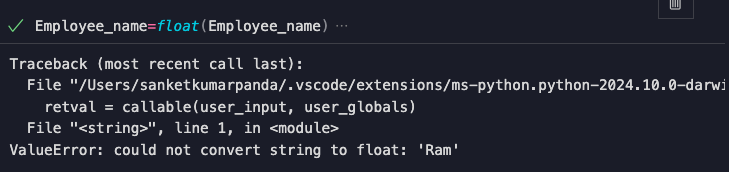

## Summary
- Conventions to name a variable
- Basic data types
  - Get data type of a variable
  - Verify if a variable is of a certain data type
  - Coerce variable to new data type